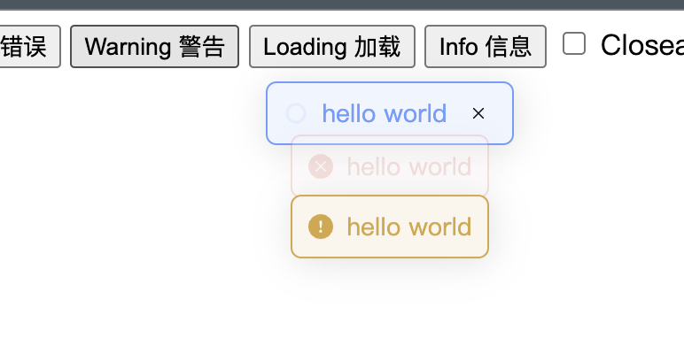

<div align="left" style="position: relative;">

<h1>SIMPLE-MESSAGEJS</h1>
<p align="left">
 <em><code>❯ Top Message Generate With Pure Javascript </code></em>
</p>
<p align="left">
 
 
 
 
</p>
<p align="left"><!-- default option, no dependency badges. -->
</p>
<p align="left">
 <!-- default option, no dependency badges. -->
</p>
</div>
<br clear="right">



## 🔗 Table of Contents

- [📍 Overview](#-overview)
- [👾 Features](#-features)
- [📁 Project Structure](#-project-structure)
- [🚀 Getting Started](#-getting-started)
  - [⚙️ Installation](#-installation)
  - [🤖 Usage](#🤖-usage)
- [📌 Project Roadmap](#-project-roadmap)
- [🔰 Contributing](#-contributing)
- [🎗 License](#-license)
- [🙌 Acknowledgments](#-acknowledgments)

---

## 📍 Overview

If you don't want to introduce the entire component library, but still need a simple page message prompt

---

## 👾 Features

- Zero Dependencies
- Pure Javascript
- Lightweight
- Easy to use

---

## 📁 Project Structure

```sh
└── simple-messagejs/
    ├── LICENSE
    ├── demo.ts
    ├── doc
    │   └── vitepress.config.js
    ├── index.html
    ├── package.json
    ├── pnpm-lock.yaml
    ├── public
    │   └── vite.svg
    ├── src
    │   ├── const.ts
    │   ├── index.ts
    │   ├── style.ts
    │   ├── typescript.svg
    │   └── vite-env.d.ts
    ├── tsconfig.json
    └── vite.config.js
```

## 🚀 Getting Started

### ⚙️ Installation

Install simple-messagejs using one of the following methods:

**Using `npm`** &nbsp;

```sh
npm install simple-messagejs --save
```

### 🤖 Usage

Run simple-messagejs using the following command:
**Using `npm`** &nbsp; [](https://www.npmjs.com/)

```typescript
import { Message } from "simple-message";

function showMessage(
  type: "success" | "error" | "info" | "warning" | "loading"
): Message {
  const result = Message[type](getMessage(), {
    showClose: isShowClose(),
  });
  return result;
}

```

### OPTIONS

| Property Name | Type | Description |
| --- | --- | --- |
| message | string \| (() => string) | The message text to be displayed. It can be a string or a function that returns a string. |
| type | MessageType | The type of the message. It can be one of the following: "success", "error", "info", "warning", "loading". The default value is "info". |
| icon | string | The SVG icon to be displayed. It should be a string representing the SVG code. |
| dangerouslyUseHTMLString | boolean | A boolean value indicating whether the `message` property should be treated as HTML. The default value is `false`. |
| customClass | string | A string representing the custom class name to be added to the message container. |
| duration | number | The duration for which the message should be displayed in milliseconds. If set to `0`, the message will not auto-close. The default value is `3000`. |
| showClose | boolean | A boolean value indicating whether the close button should be displayed. The default value is `false`. |
| center | boolean | A boolean value indicating whether the message text should be centered. The default value is `false`. |
| onClose | (instance: Message) => void | A callback function that is called when the message is closed. It takes the `Message` instance as a parameter. |
| offset | number | The offset from the top of the page where the message should be displayed. The default value is `40`. |
| appendTo | HTMLElement | The HTML element where the message should be appended. The default value is `document.body`. |

---

## 📌 Project Roadmap

- [X] **`Task 1`**: basic implement

---

## 🔰 Contributing

- **💬 [Join the Discussions](https://github.com/mizuka-wu/simple-messagejs/discussions)**: Share your insights, provide feedback, or ask questions.
- **🐛 [Report Issues](https://github.com/mizuka-wu/simple-messagejs/issues)**: Submit bugs found or log feature requests for the `simple-messagejs` project.
- **💡 [Submit Pull Requests](https://github.com/mizuka-wu/simple-messagejs/blob/main/CONTRIBUTING.md)**: Review open PRs, and submit your own PRs.

---

## 🎗 License

This project is protected under the MIT License. For more details, refer to the [LICENSE](./LICENSE) file.

---
